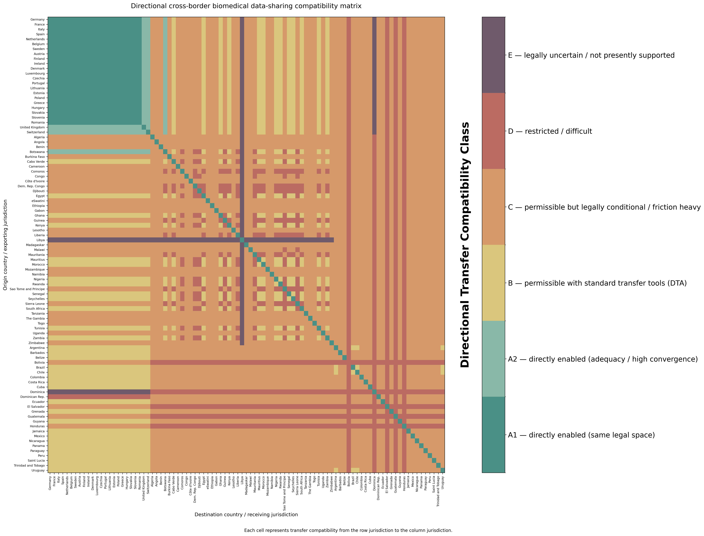
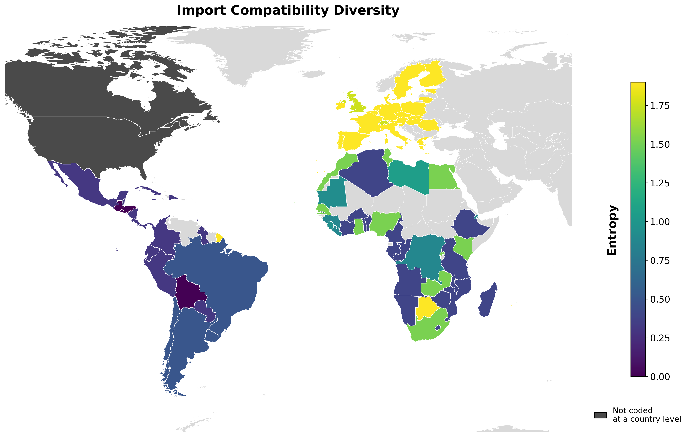

# Neurodata Governance and Cross-Border Access Figures

This repository contains the code and selected input tables used to generate figures for the manuscript *A decision support toolkit for AI-ready neurodata governance* (Botes et al., in preparation).

The figures make comparative legal and governance analysis visible: they depict directional compatibility for cross-border neurodata sharing, country-level patterns in transfer conditions, and related analyses of governance profiles. The matrix is directional because the conditions that apply when data move from jurisdiction A to B may differ from those that apply in the reverse direction. The maps summarize selected import, export, and uncertainty measures across the jurisdictions represented in the analysis.

**Scope.** This is a figure-generation repository. It is intended to support inspection and reproduction of the manuscript’s plotted matrices, maps, and related visualizations. It is not a legal decision system, a substitute for the manuscript’s methods and coding documentation, or legal advice. The figures summarize a comparative analysis and should be interpreted with the manuscript and its supplementary materials.

## Figure preview

The repository includes publication-oriented image and PDF exports alongside the analysis code. For example:

**Directional compatibility matrix** (`Code/jupyter_notebook_figures/output_files/01_directional_matrix_custom_palette.png`)



**Import entropy map** (`Code/jupyter_notebook_figures/output_files/03g_world_map_import_entropy_publication.png`)



The matrix uses ordered compatibility classes: A1 (unified legal spaces), A2 (convergent architectures), B (standard transfer pathways), C (operationally conditional pathways requiring additional safeguards), D (high-friction pathways), and E (insufficient legal certainty). These categories describe the study’s analytical coding; they are not a legal determination for any specific transfer.

## Repository contents

```text
Code/
├── jupyter_notebook_figures/
│   ├── bridge_neurodata_cross_border_interoperability_bp_edits_current.ipynb
│   ├── input_file/       # Notebook inputs
│   └── output_files/     # Figure exports (PNG, PDF, and HTML)
└── r_figures/
    ├── bridge_legal_toolkit.R
    └── input_files/      # CSV tables used by the R script
```

The Jupyter notebook generates the matrix and map figures and additional visual analyses. The R script contains complementary plots of the manuscript’s regional legal-governance tables. The repository includes CSV tables in `Code/r_figures/input_files/`; however, the current R script still refers to absolute file paths from its original development environment in several places. Those paths must be updated to the included, repository-relative CSV files before the script can run on another computer. Generated examples are retained in `Code/jupyter_notebook_figures/output_files/`; both PNG and PDF versions are available for many figures.

## Reproducing the figures

Clone or download the repository. Before running either analysis, review its setup and input paths; the R script currently requires the path updates described below.

For the notebook figures, open `Code/jupyter_notebook_figures/bridge_neurodata_cross_border_interoperability_bp_edits_current.ipynb` in Jupyter, review its setup and input paths, and execute its cells in order. For the R figures, open `Code/r_figures/bridge_legal_toolkit.R` in RStudio. Before running it, replace the machine-specific absolute input paths with paths to the corresponding CSV files in `Code/r_figures/input_files/`.

The exact software packages and versions required by each analysis are determined by the notebook and script. Consult their imports and setup cells before execution. Re-running the analyses may overwrite files in the corresponding output directory.

## Interpretation and limits

The manuscript compares governance conditions across 93 countries and 10 operative governance units in the United States and Canada. North American governance is represented at multiple legal levels and is not directly equivalent to a country-level unit; some maps therefore exclude North America where aggregation would be misleading. Regional groupings in the figures are geographic summaries and should not be read as a single regional legal regime.

Compatibility scores and map summaries operationalize the authors’ comparative coding framework. They represent a structured analysis of legal and governance sources, not a guarantee that a particular data transfer is permitted or risk-free. Laws, policies, and institutional requirements change; consult current authoritative sources and qualified legal and ethics advisors before making operational decisions.

## Associated manuscript

Botes, M., Mendes, A., Huffman, B., Fleischaker, M., Staunton, C., Townsend, B., Ogendi, P., Abdulrauf, L., Parziale, A., Skoczylas-Kizak, G., Porter, B. M., & Pestilli, F. *A decision support toolkit for AI-ready neurodata governance*. Manuscript in preparation.

Please cite the manuscript and this repository when reusing the figures or code. A permanent citation or archival DOI can be added when one is available.
